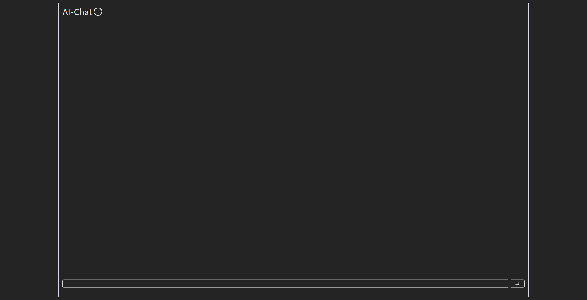
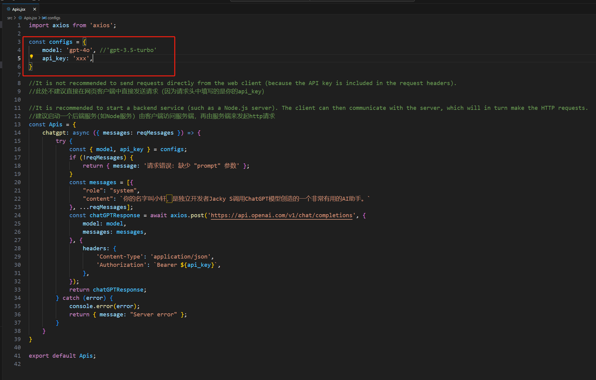
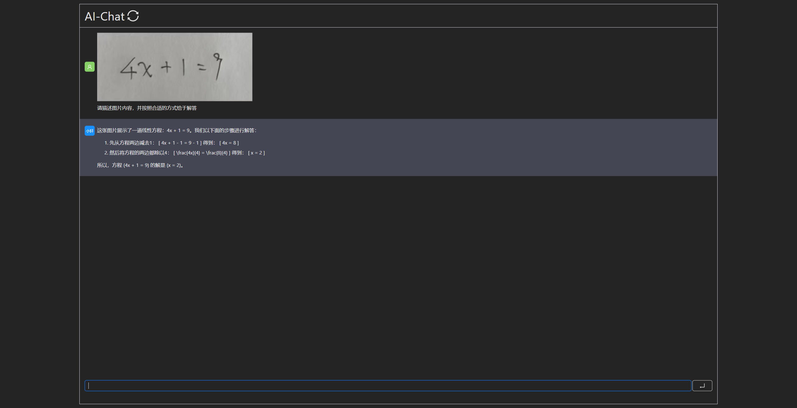

# AI-Chat-Client
>A web client for chatting with AI 
一款与AI聊天的web客户端



## How to Use ?
> You need NodeJS 18.0.0 version and above

### 1.Clone the project
```sh
git clone https://github.com/JackyS0-0/ai-chat-client.git && cd ai-chat-client
```

### 2.Edit Apis.jsx to call AI apis 
> default call openai chatgpt


### 3.Install dependencies
```sh
npm install
```

### 4.Start project
```sh
npm run dev
```

## Example
>The input box supports pasting images. You can take a screenshot and paste the image as input. See the example below.
输入框支持粘贴图片，你可以截图后粘贴图片作为输入内容，可见下方例子。

